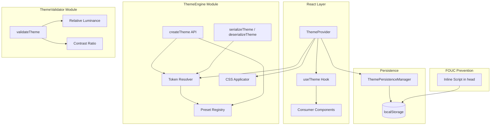

# Design Document: Advanced Theming System

## Overview

The Advanced Theming System extends the existing `ThemeContext.tsx` and `theme.css` infrastructure to support runtime-configurable theme presets, custom department themes, high-contrast accessibility mode, WCAG 2.1 contrast validation, and FOUC-free SSR rendering. Rather than replacing the current implementation, the design layers new capabilities on top of the existing `ColorScheme`, `MotionPreference`, `DensityPreference`, and `--ux4g-*` CSS custom property architecture.

The system is organized into four core modules:

1. **ThemeEngine** — Token resolution, CSS application, preset registry, and theme merging
2. **ThemeValidator** — WCAG 2.1 relative luminance and contrast ratio computation
3. **ThemePersistenceManager** — localStorage read/write with cross-tab sync and error resilience
4. **FOUC Prevention Script** — Synchronous inline `<script>` that applies stored theme before first paint

The extended `ThemeProvider` composes these modules and exposes everything through the existing `useTheme` hook, which gains new fields (`activeTheme`, `contrastMode`, `setTheme`, `setContrastMode`, `resolvedTokens`, `presets`) while preserving full backward compatibility.

## Architecture



### Data Flow

1. On page load, the **FOUC prevention inline script** reads `localStorage` keys synchronously and sets `data-theme`, `dark` class, `color-scheme`, and `data-contrast` on `<html>` before paint.
2. When React mounts, **ThemeProvider** reads the same `localStorage` keys via **ThemePersistenceManager**, reconciles with the DOM attributes already set by the inline script, and initializes state without flicker.
3. When the user calls `setTheme(name)` or `setColorScheme(scheme)`, **ThemeProvider** invokes **TokenResolver** to merge the preset/custom tokens with contrast overrides, then **CSSApplicator** writes all `--ux4g-color-*` properties to `document.documentElement` in a single `requestAnimationFrame` batch.
4. **ThemePersistenceManager** writes the new preference to `localStorage` and the `storage` event propagates changes to other tabs.
5. A `ux4g-theme-change` custom DOM event is dispatched for non-React consumers.

### Key Design Decisions

- **Extend, don't replace**: The existing `ThemeContextType` interface is widened with new optional fields. All current consumers continue to work unchanged.
- **CSS custom properties as the single source of truth**: Theme switching works by overwriting `--ux4g-color-*` properties on `:root`. No React re-renders are needed for color changes — CSS inheritance handles propagation.
- **Presets are static token maps**: Each preset is a plain object mapping semantic token names to hex color values for both light and dark variants. No runtime computation beyond merging.
- **Validation is opt-in and synchronous**: `validateTheme` is a pure function that can be called at build time or runtime. It does not block theme application.
- **FOUC script is framework-agnostic**: The inline script has zero React dependencies and works identically for SSR, SSG, and client-only rendering.

## Components and Interfaces

### ThemeToken Types

```typescript
/** Semantic token categories that can be overridden in a theme */
export interface ThemeColorTokens {
  brand?: {
    primary?: string;
    secondary?: string;
    tertiary?: string;
  };
  text?: {
    primary?: string;
    secondary?: string;
    tertiary?: string;
    disabled?: string;
    inverse?: string;
    link?: string;
    'link-hover'?: string;
  };
  background?: {
    primary?: string;
    secondary?: string;
    tertiary?: string;
    inverse?: string;
  };
  surface?: {
    primary?: string;
    secondary?: string;
    tertiary?: string;
  };
  border?: {
    default?: string;
    hover?: string;
    focus?: string;
  };
  interactive?: {
    default?: string;
    hover?: string;
    active?: string;
    disabled?: string;
  };
  feedback?: {
    success?: string;
    warning?: string;
    error?: string;
    info?: string;
  };
}

/** A complete theme definition with light and dark variants */
export interface ThemeDefinition {
  name: string;
  baseTheme?: string; // name of the preset this extends
  light: ThemeColorTokens;
  dark: ThemeColorTokens;
}

/** Serialized theme format for JSON export/import */
export interface SerializedTheme {
  version: '1.0';
  name: string;
  baseTheme: string;
  tokens: {
    light: ThemeColorTokens;
    dark: ThemeColorTokens;
  };
}


/** Preset name union type */
export type PresetName = 'default' | 'saffron-primary' | 'navy-primary' | 'green-primary' | 'high-contrast';
```

### ThemeEngine

```typescript
// src/app/contexts/theme/ThemeEngine.ts

/** Registry of all built-in presets */
export const THEME_PRESETS: Record<PresetName, ThemeDefinition>;

/**
 * Creates a custom theme by deep-merging overrides onto a base preset.
 * @throws Error if baseTheme is not a recognized preset name
 */
export function createTheme(
  name: string,
  baseTheme: PresetName,
  overrides: { light?: ThemeColorTokens; dark?: ThemeColorTokens }
): ThemeDefinition;

/**
 * Resolves the final flat token map for a given theme + color scheme + contrast mode.
 * Returns a Record<string, string> mapping CSS property names to hex values.
 */
export function resolveTokens(
  theme: ThemeDefinition,
  colorScheme: 'light' | 'dark',
  contrastMode: boolean
): Record<string, string>;

/**
 * Applies a resolved token map to document.documentElement via
 * requestAnimationFrame batching.
 */
export function applyTokensToDOM(
  tokens: Record<string, string>,
  colorScheme: 'light' | 'dark',
  contrastMode: boolean
): void;

/**
 * Serializes a ThemeDefinition to a JSON string.
 */
export function serializeTheme(theme: ThemeDefinition): string;

/**
 * Deserializes a JSON string to a ThemeDefinition.
 * @throws Error on malformed JSON or version mismatch
 */
export function deserializeTheme(json: string): ThemeDefinition;
```

### ThemeValidator

```typescript
// src/app/contexts/theme/ThemeValidator.ts

export interface ContrastFailure {
  foregroundToken: string;
  backgroundToken: string;
  foregroundValue: string;
  backgroundValue: string;
  ratio: number;
  requiredRatio: number;
  level: 'AA' | 'AAA';
}

export interface ValidationResult {
  valid: boolean;
  failures: ContrastFailure[];
  warnings: ContrastFailure[]; // ratios between 4.5:1 and 5:1
}

/**
 * Validates a theme's color token pairs against WCAG 2.1 contrast requirements.
 * Checks both light and dark variants.
 */
export function validateTheme(theme: ThemeDefinition): ValidationResult;

/**
 * Computes WCAG 2.1 relative luminance for a hex color string.
 * Formula: L = 0.2126 * R + 0.7152 * G + 0.0722 * B
 * where each channel is linearized from sRGB.
 */
export function relativeLuminance(hex: string): number;

/**
 * Computes the WCAG 2.1 contrast ratio between two colors.
 * Returns a value >= 1 (e.g., 4.5 for 4.5:1).
 */
export function contrastRatio(hex1: string, hex2: string): number;

/**
 * Parses a hex color string (#RGB, #RRGGBB) to [r, g, b] in 0-255 range.
 * @throws Error on invalid hex format
 */
export function parseHex(hex: string): [number, number, number];
```

### ThemePersistenceManager

```typescript
// src/app/contexts/theme/ThemePersistenceManager.ts

export const STORAGE_KEYS = {
  activeTheme: 'ux4g-theme-active',
  colorScheme: 'ux4g-theme-color-scheme',
  contrastMode: 'ux4g-theme-contrast-mode',
  motionPreference: 'ux4g-theme-motion',
  densityPreference: 'ux4g-theme-density',
} as const;

export interface PersistedPreferences {
  activeTheme: string | null;
  colorScheme: ColorScheme | null;
  contrastMode: boolean | null;
  motionPreference: MotionPreference | null;
  densityPreference: DensityPreference | null;
}

/** Reads all persisted preferences. Returns null for any unavailable key. */
export function loadPreferences(): PersistedPreferences;

/** Saves a single preference key. Silently no-ops if localStorage is unavailable. */
export function savePreference(key: keyof typeof STORAGE_KEYS, value: string): void;
```

### Extended ThemeProvider & useTheme Hook

The existing `ThemeContextType` is extended (not replaced):

```typescript
// Extended context type — all existing fields preserved
export interface ThemeContextType {
  // === Existing fields (backward compatible) ===
  colorScheme: ColorScheme;
  isDarkMode: boolean;
  setColorScheme: (scheme: ColorScheme) => void;
  toggleDarkMode: () => void;
  motionPreference: MotionPreference;
  setMotionPreference: (preference: MotionPreference) => void;
  densityPreference: DensityPreference;
  setDensityPreference: (preference: DensityPreference) => void;
  resetToDefaults: () => void;

  // === New fields ===
  activeTheme: string;                    // current theme name
  contrastMode: boolean;                  // high-contrast on/off
  setTheme: (theme: string | ThemeDefinition) => void;
  setContrastMode: (enabled: boolean) => void;
  resolvedTokens: Record<string, string>; // current CSS property values
  presets: PresetName[];                  // available preset names
}
```

The `ThemeProvider` component gains two new optional props:

```typescript
interface ThemeProviderProps {
  children: React.ReactNode;
  defaultTheme?: string | ThemeDefinition; // defaults to 'default'
  defaultColorScheme?: ColorScheme;        // defaults to 'system'
}
```

### FOUC Prevention Inline Script

A synchronous `<script>` block injected into `index.html` `<head>`:

```typescript
// Generates the minified inline script string (< 1KB)
export function generateFOUCScript(): string;
```

The script logic:
1. Try reading `ux4g-theme-color-scheme` from `localStorage`
2. If `system` or absent, check `matchMedia('(prefers-color-scheme: dark)')`
3. Set `document.documentElement.setAttribute('data-theme', scheme)`
4. Set `document.documentElement.style.colorScheme = scheme`
5. Toggle `document.documentElement.classList` for `dark`
6. Read `ux4g-theme-contrast-mode` and set `data-contrast="high"` if `"true"`
7. Wrap everything in try/catch to handle localStorage unavailability

## Data Models

### Theme Preset Token Definitions

Each preset maps the 7 semantic token categories. Below are the concrete color values for each preset's light variant (dark variants follow the same pattern with adjusted luminance for contrast on dark backgrounds).

#### `default` / `navy-primary` Preset (Light)

| Category | Token | Value | Source |
|----------|-------|-------|--------|
| brand | primary | `#005196` | navy-500 |
| brand | secondary | `#ff7700` | saffron-500 |
| brand | tertiary | `#008800` | green-600 |
| text | primary | `#171717` | neutral-900 |
| text | inverse | `#ffffff` | neutral-0 |
| interactive | default | `#005196` | navy-500 |
| interactive | hover | `#004178` | navy-600 |
| background | primary | `#ffffff` | neutral-0 |
| background | secondary | `#fafafa` | neutral-50 |

*(Full token set matches existing `semantic-themes.json` light values)*

#### `saffron-primary` Preset (Light)

| Category | Token | Value | Source |
|----------|-------|-------|--------|
| brand | primary | `#cc5f00` | saffron-600 |
| brand | secondary | `#005196` | navy-500 |
| brand | tertiary | `#008800` | green-600 |
| interactive | default | `#cc5f00` | saffron-600 |
| interactive | hover | `#994700` | saffron-700 |
| interactive | active | `#663000` | saffron-800 |
| border | focus | `#cc5f00` | saffron-600 |

*Note: saffron-600 (`#cc5f00`) is used instead of saffron-500 (`#ff7700`) because saffron-500 fails WCAG AA contrast on white backgrounds (ratio ~2.9:1). Saffron-600 achieves ~4.8:1 on white.*

#### `green-primary` Preset (Light)

| Category | Token | Value | Source |
|----------|-------|-------|--------|
| brand | primary | `#008800` | green-600 |
| brand | secondary | `#005196` | navy-500 |
| brand | tertiary | `#cc5f00` | saffron-600 |
| interactive | default | `#008800` | green-600 |
| interactive | hover | `#006600` | green-700 |
| interactive | active | `#004400` | green-800 |
| border | focus | `#008800` | green-600 |

#### `high-contrast` Preset (Light)

| Category | Token | Value | Rationale |
|----------|-------|-------|-----------|
| brand | primary | `#00315a` | navy-700 — deeper for max contrast |
| text | primary | `#000000` | pure black on white |
| text | secondary | `#171717` | neutral-900 instead of 600 |
| text | disabled | `#525252` | neutral-600 instead of 400 |
| background | primary | `#ffffff` | pure white |
| border | default | `#171717` | neutral-900 — visible borders |
| interactive | default | `#00315a` | navy-700 |

#### `high-contrast` Preset (Dark)

| Category | Token | Value | Rationale |
|----------|-------|-------|-----------|
| text | primary | `#ffffff` | pure white on black |
| text | secondary | `#e5e5e5` | neutral-200 |
| background | primary | `#000000` | pure black |
| border | default | `#e5e5e5` | neutral-200 — visible on black |
| interactive | default | `#99b9d5` | navy-200 — high contrast on dark |

### Token Resolution Algorithm

```
resolveTokens(theme, colorScheme, contrastMode):
  1. Start with the full default preset for the given colorScheme (light or dark)
  2. If theme !== 'default', deep-merge theme[colorScheme] tokens over the base
  3. If contrastMode === true, deep-merge the high-contrast overrides for the colorScheme
  4. Flatten the nested token object to CSS property names:
     { brand: { primary: '#005196' } } → { '--ux4g-color-brand-primary': '#005196' }
  5. Return the flat Record<string, string>
```

### Serialization Format

```json
{
  "version": "1.0",
  "name": "department-of-education",
  "baseTheme": "default",
  "tokens": {
    "light": {
      "brand": {
        "primary": "#1a5276",
        "secondary": "#d4ac0d"
      }
    },
    "dark": {
      "brand": {
        "primary": "#5dade2",
        "secondary": "#f7dc6f"
      }
    }
  }
}
```

### localStorage Key Schema

| Key | Type | Default | Description |
|-----|------|---------|-------------|
| `ux4g-theme-active` | `string` | `'default'` | Active theme preset name |
| `ux4g-theme-color-scheme` | `'light' \| 'dark' \| 'system'` | `'system'` | Color scheme preference |
| `ux4g-theme-contrast-mode` | `'true' \| 'false'` | `'false'` | High-contrast mode toggle |
| `ux4g-theme-motion` | `'full' \| 'reduced'` | `'full'` | Motion preference (existing) |
| `ux4g-theme-density` | `'comfortable' \| 'compact' \| 'spacious'` | `'comfortable'` | Density preference (existing) |


## Correctness Properties

*A property is a characteristic or behavior that should hold true across all valid executions of a system — essentially, a formal statement about what the system should do. Properties serve as the bridge between human-readable specifications and machine-verifiable correctness guarantees.*

### Property 1: Token Resolution Consistency

*For any* valid theme definition and color scheme (light or dark), the resolved token map returned by `resolveTokens` SHALL, when applied via `applyTokensToDOM`, produce CSS custom properties on `document.documentElement` whose values exactly match the `resolvedTokens` object exposed by the `useTheme` hook.

**Validates: Requirements 1.4, 2.1, 8.8**

### Property 2: DOM State Reflects Active Color Scheme

*For any* color scheme value (`light`, `dark`, or `system` with a given system preference), after the scheme is applied, the `data-theme` attribute on `document.documentElement` SHALL equal the effective scheme (`light` or `dark`), the `color-scheme` CSS property SHALL match, the `dark` class SHALL be present if and only if the effective scheme is `dark`, and the `data-contrast` attribute SHALL be `"high"` if and only if contrast mode is enabled.

**Validates: Requirements 2.2, 2.3, 2.4, 5.1, 7.3**

### Property 3: createTheme Deep-Merge Correctness

*For any* base preset name and any partial token override object (with light and/or dark variants), `createTheme` SHALL produce a `ThemeDefinition` where: (a) every token specified in the override appears in the result with the override value, (b) every token in the base preset that is not overridden appears in the result with the base value, and (c) both light and dark variants are fully populated.

**Validates: Requirements 3.2, 3.4**

### Property 4: Preference Persistence Round-Trip

*For any* valid combination of theme name, color scheme, and contrast mode boolean, saving these preferences via the ThemePersistenceManager and then loading them SHALL return values identical to the originals. Furthermore, mounting a ThemeProvider after preferences have been persisted SHALL initialize with those stored values.

**Validates: Requirements 4.1, 4.2, 4.3, 4.4**

### Property 5: Cross-Tab Theme Synchronization

*For any* valid theme name, when a `storage` event is dispatched with the `ux4g-theme-active` key set to that theme name, the ThemeProvider SHALL update its active theme to match the new value.

**Validates: Requirements 4.6**

### Property 6: Preset Completeness

*For any* theme preset in the registry, both the light and dark variants SHALL have all 7 semantic token categories (`brand`, `text`, `background`, `surface`, `border`, `interactive`, `feedback`) fully defined with no missing tokens.

**Validates: Requirements 6.6**

### Property 7: Preset WCAG AA Compliance

*For any* theme preset in the registry and *for any* variant (light or dark), every text-to-background token pair SHALL have a contrast ratio of at least 4.5:1, and every interactive-to-background token pair SHALL have a contrast ratio of at least 3:1.

**Validates: Requirements 6.7**

### Property 8: Contrast Mode AAA Compliance

*For any* theme preset with contrast mode enabled, *for any* variant (light or dark), every text-to-background token pair SHALL have a contrast ratio of at least 7:1, and every interactive-to-background token pair SHALL have a contrast ratio of at least 4.5:1.

**Validates: Requirements 7.2**

### Property 9: Contrast Mode Toggle Round-Trip

*For any* theme and color scheme, enabling contrast mode and then disabling it SHALL restore the resolved tokens to values identical to the original theme tokens (before contrast mode was enabled), and the active theme name and color scheme SHALL remain unchanged throughout.

**Validates: Requirements 7.4, 7.5**

### Property 10: Validator Detects Contrast Failures

*For any* theme definition containing a text token and background token pair whose WCAG 2.1 contrast ratio is below 4.5:1, `validateTheme` SHALL include a failure entry identifying that token pair. Similarly, *for any* interactive-to-background pair below 3:1, a failure entry SHALL be included.

**Validates: Requirements 9.2, 9.3, 9.4, 9.5**

### Property 11: Luminance and Contrast Ratio Mathematical Correctness

*For any* valid hex color string, `relativeLuminance` SHALL return a value in the range [0, 1]. *For any* two valid hex color strings, `contrastRatio` SHALL return a value in the range [1, 21]. The contrast ratio SHALL be commutative: `contrastRatio(a, b) === contrastRatio(b, a)`. The contrast ratio of any color with itself SHALL be exactly 1.

**Validates: Requirements 9.8**

### Property 12: Theme Serialization Round-Trip

*For any* valid `ThemeDefinition` object, `deserializeTheme(serializeTheme(theme))` SHALL produce an object deeply equal to the original. The serialized JSON string SHALL contain the fields `version`, `name`, `baseTheme`, and `tokens`.

**Validates: Requirements 11.3, 11.6**

### Property 13: Deserialization Rejects Malformed Input

*For any* string that is not valid JSON, `deserializeTheme` SHALL throw an error with a descriptive message identifying the parsing failure rather than returning a partial or default object.

**Validates: Requirements 11.4**

## Error Handling

### localStorage Failures

- All `localStorage.getItem` / `setItem` calls are wrapped in try/catch blocks
- On read failure: return `null` for the preference, fall back to defaults
- On write failure: silently no-op (theme still works in-memory for the session)
- The FOUC inline script wraps its entire body in try/catch, defaulting to `light` scheme

### Invalid Theme Names

- `setTheme(name)` with an unrecognized name logs a console warning and keeps the current theme
- `createTheme(name, baseTheme, overrides)` with an invalid `baseTheme` throws an `Error` with the message: `Unknown base theme: "${baseTheme}". Available presets: ${presetNames.join(', ')}`

### Invalid Color Values

- `parseHex(hex)` throws an `Error` for strings that don't match `#RGB` or `#RRGGBB` format
- `validateTheme` catches `parseHex` errors and includes them as failures in the result rather than throwing

### Deserialization Errors

- Malformed JSON: throws `Error` with `"Failed to parse theme JSON: <native parse error message>"`
- Missing required fields: throws `Error` with `"Invalid theme format: missing required field '<field>'"`
- Version mismatch: throws `Error` with `"Unsupported theme version: '<version>'. Expected '1.0'"`

### React Context Errors

- `useTheme()` outside `ThemeProvider` throws `Error` with `"useTheme must be used within a ThemeProvider"` (preserved from existing implementation)

## Testing Strategy

### Unit Tests (Vitest + Testing Library)

Example-based tests for specific scenarios and API shape:

- ThemeProvider renders and exposes all context fields (Req 1.3, 1.5, 8.1–8.10)
- ThemeProvider accepts `defaultTheme` and `defaultColorScheme` props (Req 1.1, 1.2)
- `useTheme` throws outside ThemeProvider (Req 1.7)
- Theme switch does not remount React tree (Req 2.5)
- `ux4g-theme-change` custom event is dispatched with correct payload (Req 2.6)
- `createTheme` accepts all 7 token categories (Req 3.3)
- `createTheme` throws for unknown base theme (Req 3.5)
- System preference listener is active only when colorScheme is `system` (Req 5.2, 5.4)
- Each named preset exists in the registry (Req 6.1–6.5)
- FOUC script is < 1KB minified (Req 10.4)
- FOUC script has no async/defer (Req 10.3)
- FOUC script defaults to light when localStorage unavailable (Req 10.5)
- Deserialization rejects unrecognized schema version (Req 11.5)

### Property-Based Tests (Vitest + fast-check)

Each correctness property is implemented as a single property-based test with a minimum of 100 iterations. Tests use `fast-check` for random input generation.

| Property | Test Tag | Key Generators |
|----------|----------|----------------|
| 1: Token Resolution Consistency | `Feature: advanced-theming-system, Property 1: Token resolution consistency` | Random preset × random scheme |
| 2: DOM State Reflects Active Color Scheme | `Feature: advanced-theming-system, Property 2: DOM state reflects active color scheme` | Random scheme × random system preference × random contrast boolean |
| 3: createTheme Deep-Merge | `Feature: advanced-theming-system, Property 3: createTheme deep-merge correctness` | Random base preset × random partial token overrides |
| 4: Preference Persistence Round-Trip | `Feature: advanced-theming-system, Property 4: Preference persistence round-trip` | Random theme name × random scheme × random boolean |
| 5: Cross-Tab Sync | `Feature: advanced-theming-system, Property 5: Cross-tab theme synchronization` | Random valid theme name |
| 6: Preset Completeness | `Feature: advanced-theming-system, Property 6: Preset completeness` | All presets (exhaustive) |
| 7: Preset WCAG AA | `Feature: advanced-theming-system, Property 7: Preset WCAG AA compliance` | All presets × both variants (exhaustive) |
| 8: Contrast Mode AAA | `Feature: advanced-theming-system, Property 8: Contrast mode AAA compliance` | All presets × both variants (exhaustive) |
| 9: Contrast Mode Round-Trip | `Feature: advanced-theming-system, Property 9: Contrast mode toggle round-trip` | Random preset × random scheme |
| 10: Validator Detects Failures | `Feature: advanced-theming-system, Property 10: Validator detects contrast failures` | Random hex color pairs with known low contrast |
| 11: Luminance & Contrast Math | `Feature: advanced-theming-system, Property 11: Luminance and contrast ratio mathematical correctness` | Random valid hex strings |
| 12: Serialization Round-Trip | `Feature: advanced-theming-system, Property 12: Theme serialization round-trip` | Random ThemeDefinition objects |
| 13: Deserialization Rejects Malformed | `Feature: advanced-theming-system, Property 13: Deserialization rejects malformed input` | Random non-JSON strings |

### Test File Organization

```
src/app/contexts/theme/
├── ThemeEngine.ts
├── ThemeEngine.test.ts          # Unit + property tests for engine
├── ThemeValidator.ts
├── ThemeValidator.test.ts       # Unit + property tests for validator
├── ThemePersistenceManager.ts
├── ThemePersistenceManager.test.ts
├── ThemeProvider.tsx             # Extended provider
├── ThemeProvider.test.tsx        # Integration tests
├── fouc-script.ts               # FOUC script generator
├── fouc-script.test.ts
├── presets/
│   ├── default.ts
│   ├── saffron-primary.ts
│   ├── green-primary.ts
│   ├── high-contrast.ts
│   └── index.ts
└── types.ts                     # Shared type definitions
```
