# Design Document: Component Doc Page Redesign

## Overview

This design transforms the current `ComponentDocumentation.tsx` (887-line, tab-based layout) into a premium, editorial-quality single-scroll documentation experience. The redesign introduces a component hierarchy of reusable shells and section-specific treatments while preserving the existing `ComponentDocumentationProps` interface so all 78 component pages continue to work without modification.

The key architectural change is replacing the tab-based content switching (`activeTab` state) with a vertically stacked, scroll-driven layout where each section has a distinct visual treatment based on its content type (guidance, interactive, compliance, applied, technical). A new `SectionShell` component provides four visual variants (`default`, `tonal`, `elevated`, `bordered`) to eliminate border fatigue while maintaining clear visual rhythm.

Supporting changes widen the 3-column layout, lighten the right TOC, and add search/count badges to the left sidebar.

## Architecture

### Component Tree (Redesigned)

```mermaid
graph TD
    Layout["Layout.tsx (wider max-w)"]
    Layout --> Sidebar["ComponentSidebar (220px, search + badges)"]
    Layout --> Main["main#main-content"]
    Layout --> TOC["ComponentPageTOC (180px, lighter)"]

    Main --> CDT["ComponentDocumentation"]
    CDT --> Hero["ComponentHero"]
    CDT --> WhenToUse["SectionShell variant=tonal → When to Use"]
    CDT --> DoDont["SectionShell variant=tonal → DoDontPanel"]
    CDT --> Variants["SectionShell variant=default → Variants/Examples"]
    CDT --> Playground["SectionShell variant=elevated → ComponentPlayground"]
    CDT --> PropsAPI["SectionShell variant=bordered → Props API Table"]
    CDT --> A11y["SectionShell variant=tonal → AccessibilitySection"]
    CDT --> UseCases["SectionShell variant=default → GovernmentUseCases"]
    CDT --> CodeDL["SectionShell variant=bordered → Code Downloads"]
    CDT --> Comparison["SectionShell variant=bordered → Comparison Table"]
    CDT --> Tokens["SectionShell variant=bordered → Token Mappings"]
    CDT --> Install["SectionShell variant=default → Installation"]
    CDT --> Changelog["SectionShell variant=default → Changelog"]
    CDT --> Research["SectionShell variant=default → Research"]
```



### Data Flow

The redesigned `ComponentDocumentation` receives the same props as today. Internally it:

1. Renders `ComponentHero` from `name`, `description`, `category`, `maturity`, `tier`, `since`, `updated`, `sandbox`
2. Extracts guidance/playground/changelog/research sections from `additionalContent` by rendering it in a designated slot within the new section order
3. Renders inline sections for Props API, Examples, Code Downloads, Comparison, and Tokens (previously behind tabs)
4. Conditionally renders Accessibility, Use Cases, and Tokens sections based on prop presence

### Section Rendering Order

| Order | Section | Shell Variant | Source Prop |
|-------|---------|--------------|-------------|
| 1 | Component Hero | (standalone) | name, description, category, maturity, tier, since, updated |
| 2 | Additional Content (When to Use, Do/Don't, Playground, Related, etc.) | (passthrough) | additionalContent |
| 3 | Variants / Examples | bordered | examples |
| 4 | Props API | bordered | props |
| 5 | Code Downloads | bordered | reactCode, angularCode, webComponentsCode |
| 6 | Accessibility | tonal | accessibility |
| 7 | Government Service Use Cases | default | useCases |
| 8 | Comparison | bordered | comparisons |
| 9 | Token Mappings | bordered | tokens |
| 10 | Installation | default | (static) |
| 11 | Changelog & Research | default | (from additionalContent) |

> The `additionalContent` slot is rendered early (position 2) because it contains the Playground, When to Use, and Do/Don't sections that the wireframe places near the top. Individual component pages already control the internal ordering of their `additionalContent` JSX.

## Components and Interfaces

### 1. SectionShell

Reusable wrapper replacing the current bordered-card-per-section pattern.

```typescript
interface SectionShellProps {
  /** Unique section id for TOC scroll-spy linking */
  id: string;
  /** Section heading text */
  title?: string;
  /** Optional icon rendered beside the title */
  icon?: React.ReactNode;
  /** Optional badge rendered beside the title (e.g., count, WCAG level) */
  badge?: React.ReactNode;
  /** Visual variant */
  variant?: 'default' | 'tonal' | 'elevated' | 'bordered';
  /** Section content */
  children: React.ReactNode;
  /** Additional CSS classes */
  className?: string;
}
```

Variant rendering rules:
- `default` — `space-y` padding only, no background/border/shadow
- `tonal` — `bg-muted/30 rounded-2xl p-6 md:p-8`, no border
- `elevated` — `bg-card rounded-2xl p-6 md:p-8 shadow-sm`, no border
- `bordered` — `bg-card rounded-2xl p-6 md:p-8 border border-border`

All variants share: `scroll-mt-24` for scroll-spy offset, heading rendered as `<h2>` with `text-2xl font-bold`.

### 2. ComponentHero

Premium hero replacing the current header + tab bar.

```typescript
interface ComponentHeroProps {
  name: string;
  description: string;
  category: string;
  maturity: 'draft' | 'beta' | 'stable' | 'deprecated';
  tier: 'foundation' | 'core' | 'composite' | 'pattern';
  since: string;
  updated?: string;
  sandbox?: { href: string; label?: string };
}
```

Layout:
- Subtle gradient background: `bg-gradient-to-br from-card via-card to-primary/5`
- Category label: `text-xs font-bold uppercase tracking-widest text-muted-foreground`
- Title: `text-4xl font-extrabold tracking-tight`
- Description: `text-lg text-muted-foreground max-w-3xl leading-relaxed`
- Metadata row: horizontal flex of `MetadataChip` components
- Action row: "View Source", "Open in Figma", "Open Sandbox" buttons
- Mobile (< 768px): stacks metadata + actions vertically, title shrinks to `text-2xl`

### 3. MetadataChip

Small pill badge for component metadata.

```typescript
interface MetadataChipProps {
  icon?: React.ReactNode;
  label: string;
  colorClass?: string; // e.g., 'bg-green-100 text-green-800'
}
```

Renders: `inline-flex items-center gap-1.5 px-3 py-1.5 rounded-full text-xs font-semibold shadow-sm`

### 4. DoDontPanel (enhanced)

Side-by-side Do/Don't comparison with Preview/Code toggle.

```typescript
interface DoDontExample {
  preview: React.ReactNode;
  code: string;
  caption: string;
}

interface DoDontPanelProps {
  doExamples: DoDontExample[];
  dontExamples: DoDontExample[];
}
```

Visual treatment:
- Do panel: `border-l-4 border-green-500 bg-green-50/50 dark:bg-green-950/20 rounded-xl p-5`
- Don't panel: `border-l-4 border-red-500 bg-red-50/50 dark:bg-red-950/20 rounded-xl p-5`
- Each panel has a Preview/Code toggle (tab pair) at the top
- Mobile (< 768px): stacks vertically

### 5. AccessibilitySection

Compliance-themed treatment for the accessibility content.

```typescript
interface AccessibilitySectionProps {
  wcagLevel: string;
  features: string[];
  keyboardSupport: { key: string; action: string }[];
  screenReader: string[];
}
```

Visual treatment:
- Uses `SectionShell variant="tonal"` with a shield icon (`ShieldCheck` from lucide-react)
- WCAG level badge rendered as a `MetadataChip` with green tint
- Features rendered as a checklist with `Check` icons
- Keyboard support as a clean table
- Screen reader notes as an info list

### 6. GovernmentUseCasesSection

Rich scenario cards for government use cases.

```typescript
interface GovernmentUseCasesSectionProps {
  useCases: UseCase[];
}
```

Visual treatment:
- Uses `SectionShell variant="default"`
- Each use case rendered as a card with:
  - Numbered indicator: `w-10 h-10 rounded-xl bg-primary/10 text-primary font-bold`
  - Title, description, scenario context, implementation hint
  - Hover: `hover:border-primary/30 hover:shadow-md transition-all`

### 7. Layout.tsx Changes

```
Current:  max-w-[1600px] | sidebar 200px | main flex-1 | TOC 160px
Proposed: max-w-[1800px] | sidebar 220px | main flex-1 | TOC 180px
```

Breakpoint behavior:
- `≥ 1280px (xl)`: 3-column — sidebar 220px, main flex-1, TOC 180px
- `1024px–1279px (lg)`: 2-column — sidebar 200px, main flex-1, TOC hidden
- `< 1024px`: 1-column — sidebar hidden (hamburger/drawer), main full-width

### 8. ComponentSidebar.tsx Changes

New features:
- Search input at top: `<input>` with `Search` icon, filters component list by name
- Category count badges: `<span>` showing item count next to each category heading
- Active link: adds `border-l-2 border-primary` alongside existing `bg-primary/10`
- Category spacing increased to `mb-5`
- Category heading: `text-[11px] font-bold uppercase tracking-wider mb-2`
- Link items: `py-2 pl-3 text-[13px] rounded-lg`

### 9. ComponentPageTOC.tsx Changes

- Heading: "On this page" — `text-[10px] font-bold uppercase tracking-[0.15em] mb-3`
- Items: `text-[12px] leading-relaxed py-1.5` (increased from `py-1`)
- Active: `border-l-2 border-primary text-primary font-medium`
- Inactive: `text-muted-foreground/70` (lighter than current)
- Label truncation: `max-w-[160px] truncate` (≈40 chars at 12px)
- Scroll-spy rootMargin remains: `'-80px 0px -60% 0px'`

## Data Models

### ComponentDocumentationProps (unchanged)

The existing interface is preserved exactly as-is to maintain backward compatibility with all 78 component pages:

```typescript
interface ComponentDocumentationProps {
  name: string;
  description: string;
  category: string;
  maturity: 'draft' | 'beta' | 'stable' | 'deprecated';
  tier: 'foundation' | 'core' | 'composite' | 'pattern';
  since: string;
  updated?: string;
  props: PropDefinition[];
  examples: CodeExample[];
  reactCode: { component: string; types: string; variants?: string };
  angularCode: { component: string; module: string; types: string };
  webComponentsCode?: { component: string; html: string; package?: string };
  comparisons: DesignSystemComparison[];
  accessibility: {
    wcagLevel: string;
    features: string[];
    keyboardSupport: { key: string; action: string }[];
    screenReader: string[];
  };
  tokens?: { file: string; mappings: { property: string; token: string; value: string }[] };
  useCases?: UseCase[];
  additionalContent?: React.ReactNode;
  preview?: React.ReactNode;
  governmentContext?: { relevance?: string; indianContext?: string; wcagNotes?: string; [key: string]: string | undefined };
  sandbox?: { href: string; label?: string; description?: string; exampleLabel?: string };
}
```

### SectionShell Variant Map

```typescript
const VARIANT_CLASSES: Record<SectionShellVariant, string> = {
  default: '',
  tonal: 'bg-muted/30 rounded-2xl p-6 md:p-8',
  elevated: 'bg-card rounded-2xl p-6 md:p-8 shadow-sm',
  bordered: 'bg-card rounded-2xl p-6 md:p-8 border border-border',
};
```

### Maturity Config (unchanged)

```typescript
const MATURITY_CONFIG = {
  draft:      { label: 'Draft',      color: 'bg-blue-100 text-blue-800',   icon: '🔵' },
  beta:       { label: 'Beta',       color: 'bg-yellow-100 text-yellow-800', icon: '🟡' },
  stable:     { label: 'Stable',     color: 'bg-green-100 text-green-800',  icon: '🟢' },
  deprecated: { label: 'Deprecated', color: 'bg-red-100 text-red-800',     icon: '🔴' },
};
```

## Correctness Properties

*A property is a characteristic or behavior that should hold true across all valid executions of a system — essentially, a formal statement about what the system should do. Properties serve as the bridge between human-readable specifications and machine-verifiable correctness guarantees.*

### Property 1: Hero content completeness

*For any* valid combination of component name, description, category, maturity status, tier, and since version, the ComponentHero SHALL render all of these values in the output: the category label, the component title, the description paragraph, and a metadata chip for each of maturity, tier, category, and since.

**Validates: Requirements 1.1, 1.2**

### Property 2: Section rendering order

*For any* valid ComponentDocumentationProps with all optional sections provided, the rendered DOM SHALL contain section elements whose IDs appear in the specified order: hero content first, then additionalContent slot, then examples, props API, code downloads, accessibility, use cases, comparison, tokens, and installation.

**Validates: Requirements 2.1**

### Property 3: Section ID uniqueness

*For any* valid ComponentDocumentationProps, all rendered `section[id]` and `h2[id]` elements SHALL have unique, non-empty ID values.

**Validates: Requirements 2.3**

### Property 4: SectionShell variant class mapping

*For any* variant value from the set {default, tonal, elevated, bordered}, rendering a SectionShell with that variant SHALL produce a container element whose CSS classes match exactly the expected class set for that variant (e.g., tonal → bg-muted/30 + rounded-2xl + padding, no border; bordered → border + bg-card + rounded-2xl; default → no bg/border/shadow).

**Validates: Requirements 3.3, 3.4, 3.5, 3.6, 3.7**

### Property 5: TOC label truncation

*For any* heading label string, if its length exceeds 40 characters, the rendered TOC item label SHALL be truncated to at most 40 visible characters with an ellipsis. If the label is 40 characters or fewer, it SHALL be rendered in full.

**Validates: Requirements 5.4**

### Property 6: Sidebar search filtering

*For any* non-empty search string typed into the sidebar filter input, every visible component link in the filtered list SHALL contain the search string as a case-insensitive substring of the component name. Components whose names do not match SHALL not be visible.

**Validates: Requirements 6.4**

### Property 7: Sidebar category count accuracy

*For any* category group rendered in the ComponentSidebar, the count badge displayed next to the category heading SHALL equal the actual number of component items in that category's data array.

**Validates: Requirements 6.6**

### Property 8: Use case card field completeness

*For any* use case object with title and description (and optionally scenario and implementation), the rendered use case card SHALL contain the numbered indicator, the title text, the description text, and any provided scenario or implementation text.

**Validates: Requirements 7.6**

### Property 9: Semantic HTML structure preservation

*For any* valid ComponentDocumentationProps, the rendered output SHALL contain: exactly one `h1` element (the component title), `h2` elements for each major section, proper heading hierarchy (no skipped levels), `section` elements wrapping major content areas, and `table` elements for tabular data (props, keyboard support, comparisons).

**Validates: Requirements 8.1, 8.4**

### Property 10: Graceful optional prop omission

*For any* subset of optional props (useCases, tokens, webComponentsCode, governmentContext, sandbox, preview, additionalContent) that are omitted from ComponentDocumentationProps, the rendered output SHALL not contain empty wrapper elements for those sections, SHALL not throw rendering errors, and SHALL maintain correct spacing between the remaining visible sections.

**Validates: Requirements 9.2, 9.3**

## Error Handling

### Missing Required Props

If any required prop (`name`, `description`, `category`, `maturity`, `tier`, `since`) is `undefined` or empty string, `ComponentDocumentation` renders a fallback card:

```tsx
<div className="p-8 text-center text-muted-foreground">
  <p className="text-lg font-semibold">Component documentation unavailable</p>
  <p className="text-sm mt-2">Missing required prop: {missingPropName}</p>
</div>
```

This prevents a crash and gives developers a clear signal during development.

### Empty Arrays

- `props: []` → Props API section renders with an "No props documented yet" message
- `examples: []` → Examples section is omitted entirely
- `comparisons: []` → Comparison section is omitted
- `useCases: []` → Use Cases section is omitted (same as `undefined`)

### Invalid Maturity/Tier Values

If `maturity` or `tier` contains an unexpected value, the MetadataChip falls back to a neutral style (`bg-muted text-foreground`) and renders the raw string value.

### additionalContent Rendering Errors

The `additionalContent` slot is wrapped in an error boundary that catches rendering errors from individual component pages and displays a fallback message without breaking the rest of the documentation page.

## Testing Strategy

### Unit Tests (Vitest + Testing Library)

Focus on specific examples and edge cases:

- **ComponentHero**: renders with all maturity states, renders without sandbox prop, mobile responsive classes
- **SectionShell**: each variant produces correct classes, renders children, renders title/icon/badge
- **DoDontPanel**: Preview/Code toggle switches content, green/red styling applied correctly
- **AccessibilitySection**: shield icon present, WCAG badge rendered, checklist items rendered
- **GovernmentUseCasesSection**: numbered indicators sequential, optional fields omitted gracefully
- **ComponentSidebar**: search input filters list, active link highlighted, count badges accurate
- **ComponentPageTOC**: "On this page" heading present, active item styling, label truncation
- **Layout**: 3-column at xl, 2-column at lg, 1-column below lg
- **ComponentDocumentation**: all sections rendered inline (no tabs), fallback for missing props, backward compatibility with existing prop shapes

### Property-Based Tests (Vitest + fast-check)

Each correctness property above is implemented as a property-based test using `fast-check` for input generation:

- Minimum 100 iterations per property test
- Tag format: `Feature: component-doc-page-redesign, Property {N}: {title}`
- Generators produce random valid `ComponentDocumentationProps` objects with varying combinations of optional fields
- String generators produce component names, descriptions, and search queries of varying lengths including edge cases (empty, very long, special characters, Unicode)

### Visual Regression Tests (Playwright)

- Full-page screenshots at 1440px, 1024px, and 375px viewports
- Light and dark mode variants
- Comparison against baseline screenshots for the Alert component page (representative)

### Integration Tests

- IntersectionObserver scroll-spy behavior (mocked)
- Keyboard navigation through the full page
- Route-based sidebar active state
