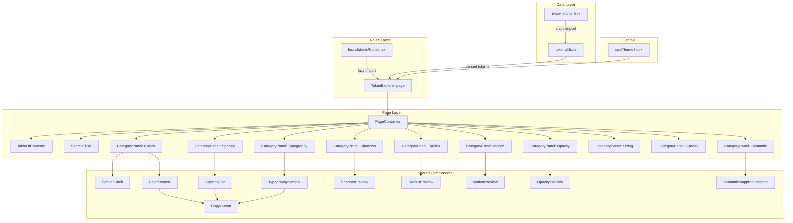

# Design Document: Design Token Documentation Page

## Overview

The Design Token Documentation Page is an interactive explorer rendered at `/foundations/tokens` that lets developers and designers browse, search, and copy all UX4G design tokens. It reads token data from the existing JSON source files at build time and renders category-organized panels with live previews (color swatches, spacing bars, typography samples, shadow/radius/motion/opacity previews, sizing tables, and z-index visualizations). The page is theme-aware via the existing `useTheme` hook, so all previews update automatically when the user switches between light/dark/system modes.

The page follows existing project conventions: lazy-loaded route in `foundationsRoutes`, `PageContainer` + `SectionShell` wrappers, `forwardRef` + `displayName` on components, `cn()` for class merging, `ux4g-` CSS prefix, and `var(--ux4g-*, fallback)` for all visual values.

## Architecture



The architecture is a single page component (`TokenExplorer`) that statically imports token JSON at build time via a utility module (`tokenUtils.ts`). Each token category is rendered by a `CategoryPanel` wrapper (using `SectionShell`) containing category-specific preview components. A `SearchFilter` at the top filters tokens across all categories using a shared search state. All preview components use CSS custom properties (`var(--ux4g-*, fallback)`) so theme changes propagate automatically without re-parsing token data.

### Key Design Decisions

1. **Static JSON imports over runtime fetch**: Token JSON files are imported at build time via Vite's JSON import support. This eliminates loading states, ensures tokens are always available, and enables tree-shaking of unused data. The token set is fixed at build time anyway.

2. **Flat token normalization**: The nested JSON structure is normalized into a flat array of `TokenEntry` objects by `tokenUtils.ts`. This makes filtering, rendering, and testing uniform across all categories regardless of JSON nesting depth.

3. **CSS variable previews over resolved values**: All visual previews apply styles via `var(--ux4g-*, fallback)` rather than hardcoded values. This means theme switches update previews automatically through CSS cascade — no React re-render of token data needed.

4. **Single search state with category filtering**: One `useState` + debounced input controls visibility across all categories. Categories with zero matches are hidden entirely. This keeps the implementation simple and the UX predictable.

5. **Component-per-preview-type**: Each token category has its own preview component (ColorSwatch, SpacingBar, etc.) rather than a generic renderer. This allows category-specific visual treatments (e.g., horizontal bars for spacing, animated elements for motion) while keeping each component focused and testable.

## Components and Interfaces

### File Structure

```
src/app/pages/DesignTokens/
├── DesignTokens.tsx              # Main page component (TokenExplorer)
├── DesignTokens.test.tsx         # Tests
├── components/
│   ├── TableOfContents.tsx       # TOC with smooth-scroll links
│   ├── SearchFilter.tsx          # Debounced search input with ARIA live region
│   ├── CategoryPanel.tsx         # SectionShell wrapper for a token category
│   ├── TokenCard.tsx             # Base card with name, value, CSS var, CopyButtons
│   ├── CopyButton.tsx            # Clipboard copy with success/error feedback
│   ├── ColorSwatch.tsx           # Color preview with hex, a11y badge
│   ├── SpacingBar.tsx            # Horizontal bar proportional to spacing value
│   ├── TypographySample.tsx      # Font family/size/weight live sample
│   ├── ShadowPreview.tsx         # Box with applied shadow
│   ├── RadiusPreview.tsx         # Box with applied border-radius
│   ├── MotionPreview.tsx         # Animated element for duration/easing
│   ├── OpacityPreview.tsx        # Element at token opacity level
│   └── SemanticMappingIndicator.tsx  # "→ base.token.path" label
└── utils/
    └── tokenUtils.ts             # JSON parsing, normalization, CSS var name generation
```

### Core Interfaces

```typescript
/** Normalized token entry used across all categories */
interface TokenEntry {
  /** Display name (e.g., "saffron-500", "spacing-4") */
  name: string;
  /** Resolved value (e.g., "#ff7700", "1rem") */
  value: string;
  /** CSS custom property name (e.g., "--ux4g-color-saffron-500") */
  cssVariable: string;
  /** Token category */
  category: TokenCategory;
  /** Optional sub-category (e.g., "saffron", "inset", "fontFamily") */
  group?: string;
  /** Description from JSON */
  description?: string;
  /** a11y annotation for color tokens */
  a11y?: string;
  /** Reference path for semantic tokens (e.g., "{ux4g.color.base.navy.500}") */
  reference?: string;
}

type TokenCategory =
  | 'colors'
  | 'spacing'
  | 'typography'
  | 'shadows'
  | 'radius'
  | 'motion'
  | 'opacity'
  | 'sizing'
  | 'z-index'
  | 'semantic';

/** Category metadata for rendering panels */
interface CategoryConfig {
  id: TokenCategory;
  title: string;
  description: string;
  icon: React.ReactNode;  // lucide-react icon
}

/** Props for the CopyButton component */
interface CopyButtonProps {
  /** Text to copy to clipboard */
  text: string;
  /** Accessible label (e.g., "Copy CSS variable --ux4g-color-saffron-500") */
  label: string;
}

/** Props for CategoryPanel */
interface CategoryPanelProps {
  config: CategoryConfig;
  tokens: TokenEntry[];
  /** Whether this panel is visible (based on search filter) */
  visible: boolean;
  children: React.ReactNode;
}
```

### Component Specifications

**TokenExplorer (DesignTokens.tsx)**: The page component. Wraps content in `PageContainer`. Manages search state via `useState<string>` with a 150ms debounced value. Filters the normalized token list and passes filtered subsets to each `CategoryPanel`. Reads `useTheme()` for the active color scheme badge.

**SearchFilter**: An `<input type="search">` with `aria-label="Search design tokens"`. Calls `onChange` with debounced value. Renders an `aria-live="polite"` region announcing `"{n} tokens found"` or `"No tokens found"` after filtering.

**CategoryPanel**: Wraps children in `<SectionShell id={category} title={title} icon={icon}>`. Hidden via `hidden` attribute when `visible` is false (preserves DOM for search restoration).

**CopyButton**: Calls `navigator.clipboard.writeText(text)`. On success, swaps icon to a checkmark for 2 seconds. On failure (or if API unavailable), shows an error icon briefly. Uses `aria-label={label}` for accessibility.

**ColorSwatch**: Renders a `<div>` with `style={{ backgroundColor: 'var(--ux4g-color-saffron-500, #ff7700)' }}`. Displays token name, hex value, CSS variable via `TokenCard`. Conditionally renders an a11y badge (e.g., "AA", "AAA") when `token.a11y` is present.

**SpacingBar**: Renders a horizontal `<div>` with `style={{ width: token.value }}` (capped at 100% of container). Displays name, rem value, px equivalent, CSS variable.

**TypographySample**: For font families, renders sample text in the corresponding script using a `SCRIPT_SAMPLES` map (e.g., `{ devanagari: 'हिन्दी', tamil: 'தமிழ்', ... }`). For font sizes, renders text at the actual size. For weights/line-heights/letter-spacing, renders with the applied style.

**MotionPreview**: Renders a box that translates horizontally over the token's duration on hover/focus. Respects `motionPreference` from `useTheme()` — when `'reduced'`, shows a static indicator instead. Easing tokens show a small SVG curve visualization.

**OpacityPreview**: Renders a colored box at the token's opacity level with a checkerboard background pattern to make transparency visible.

**SemanticMappingIndicator**: Renders `"→ {reference}"` as a muted label next to the semantic token's resolved value, showing which base token it maps to.

## Data Models

### Token Normalization Pipeline

```typescript
// tokenUtils.ts

import colorsJson from '@/app/tokens-package/tokens/base/colors.json';
import spacingJson from '@/app/tokens-package/tokens/base/spacing.json';
import typographyJson from '@/app/tokens-package/tokens/base/typography.json';
import shadowsJson from '@/app/tokens-package/tokens/base/shadows.json';
import radiusJson from '@/app/tokens-package/tokens/base/radius.json';
import motionJson from '@/app/tokens-package/tokens/base/motion.json';
import opacityJson from '@/app/tokens-package/tokens/base/opacity.json';
import sizingJson from '@/app/tokens-package/tokens/base/sizing.json';
import zIndexJson from '@/app/tokens-package/tokens/base/z-index.json';
import semanticJson from '@/app/tokens-package/tokens/semantic.json';

/**
 * Recursively walks a token JSON object and produces a flat array
 * of TokenEntry objects. Builds the CSS variable name from the
 * JSON path (e.g., ux4g.color.base.saffron.500 → --ux4g-color-saffron-500).
 */
function flattenTokens(
  obj: Record<string, unknown>,
  category: TokenCategory,
  pathSegments: string[] = [],
  group?: string
): TokenEntry[];

/**
 * Generates the CSS custom property name from a token path.
 * Strips the "base" segment and joins with hyphens.
 * e.g., ["ux4g", "color", "base", "saffron", "500"] → "--ux4g-color-saffron-500"
 */
function toCssVariable(segments: string[]): string;

/**
 * Converts rem/px string values to pixel equivalents for display.
 * e.g., "0.25rem" → "4px", "1rem" → "16px"
 */
function toPixels(value: string): string | null;

/** All normalized tokens, grouped by category */
export const TOKEN_DATA: Record<TokenCategory, TokenEntry[]>;

/** Category configurations with titles, descriptions, icons */
export const CATEGORY_CONFIGS: CategoryConfig[];

/** Script sample text for each font family key */
export const SCRIPT_SAMPLES: Record<string, string>;
```

### Search/Filter Model

```typescript
// In DesignTokens.tsx
const [searchQuery, setSearchQuery] = useState('');
const debouncedQuery = useDebouncedValue(searchQuery, 150);

/** Filter tokens by matching name, cssVariable, or value */
function filterTokens(tokens: TokenEntry[], query: string): TokenEntry[] {
  if (!query.trim()) return tokens;
  const lower = query.toLowerCase();
  return tokens.filter(t =>
    t.name.toLowerCase().includes(lower) ||
    t.cssVariable.toLowerCase().includes(lower) ||
    t.value.toLowerCase().includes(lower)
  );
}
```

### Clipboard Model

```typescript
// In CopyButton.tsx
type CopyState = 'idle' | 'success' | 'error';

async function copyToClipboard(text: string): Promise<boolean> {
  try {
    await navigator.clipboard.writeText(text);
    return true;
  } catch {
    return false;
  }
}
```


## Correctness Properties

*A property is a characteristic or behavior that should hold true across all valid executions of a system — essentially, a formal statement about what the system should do. Properties serve as the bridge between human-readable specifications and machine-verifiable correctness guarantees.*

### Property 1: Token rendering completeness

*For any* token entry present in the source JSON files, the normalized `TOKEN_DATA` output should contain a corresponding `TokenEntry` with a non-empty `name`, `value`, and `cssVariable`.

**Validates: Requirements 3.1, 4.1, 5.1, 6.1, 6.2, 7.1**

### Property 2: Token entry information completeness

*For any* `TokenEntry` produced by the normalization pipeline, the entry should contain a non-empty `name`, a non-empty `value`, and a `cssVariable` that starts with `--ux4g-`.

**Validates: Requirements 3.2, 4.3, 5.5, 6.5, 7.4**

### Property 3: Color a11y annotation fidelity

*For any* color token in the source JSON that has an `a11y` field, the corresponding `TokenEntry` should have a non-empty `a11y` property matching the source value. For any color token without an `a11y` field, the `TokenEntry.a11y` should be `undefined`.

**Validates: Requirements 3.5**

### Property 4: Search filtering correctness

*For any* non-empty search query string and any token visible after filtering, that token's `name`, `cssVariable`, or `value` should contain the query as a case-insensitive substring.

**Validates: Requirements 8.2, 8.3**

### Property 5: Search clear round-trip

*For any* token list and any search query, filtering the list and then clearing the query (empty string) should produce a result set identical to the original unfiltered list.

**Validates: Requirements 8.4**

### Property 6: Copy to clipboard correctness

*For any* `TokenEntry`, invoking the CSS variable copy action should write exactly the `cssVariable` string to the clipboard, and invoking the value copy action should write exactly the `value` string.

**Validates: Requirements 9.3**

### Property 7: Semantic mapping indicator accuracy

*For any* semantic token in `semantic.json` that references a base token (via `{ux4g.*}` syntax), the corresponding `TokenEntry` should have a `reference` field containing the base token path.

**Validates: Requirements 11.1, 11.2**

### Property 8: Font family script sample mapping

*For any* font family token key in the typography JSON, the `SCRIPT_SAMPLES` map should contain a corresponding entry with non-empty sample text in the appropriate script.

**Validates: Requirements 5.2**

### Property 9: CSS variable naming convention

*For any* `TokenEntry` produced by `toCssVariable`, the generated CSS variable should follow the pattern `--ux4g-{category}-{path}` where segments are joined by hyphens and the `base` path segment is stripped.

**Validates: Requirements 3.4, 10.3**

### Property 10: Spacing pixel equivalence

*For any* spacing token with a rem-based value, the `toPixels` function should return the correct pixel equivalent (value × 16), and for any px-based value, it should return the value unchanged.

**Validates: Requirements 4.2, 4.3**

## Error Handling

| Scenario | Handling |
|---|---|
| Clipboard API unavailable | `CopyButton` catches the error, sets state to `'error'`, shows error icon for 2 seconds, then resets to `'idle'` |
| Clipboard write fails | Same as above — `navigator.clipboard.writeText()` rejection is caught |
| Empty search results | All `CategoryPanel` components hidden; `SearchFilter` ARIA live region announces "No tokens found" |
| Missing token JSON field | `flattenTokens` skips entries without a `value` field; logs a dev-mode warning |
| Invalid rem/px value in `toPixels` | Returns `null`; the UI displays the raw value without a pixel equivalent |
| Font family not in SCRIPT_SAMPLES | Falls back to generic Latin sample text "The quick brown fox…" |
| Theme context unavailable | `useTheme()` throws if outside `ThemeProvider` — this is enforced by the app's root `App.tsx` which always wraps in `ThemeProvider` |

## Testing Strategy

### Unit Tests (Vitest + Testing Library)

Unit tests cover specific examples, edge cases, and integration points:

- **Route registration**: Verify `foundationsRoutes` includes a lazy route for `/foundations/tokens`
- **Page rendering**: Verify `DesignTokens` renders page title, description, and all 9 category headings + semantic section
- **TOC links**: Verify each TOC link has an `href` matching a category section `id`
- **Search debounce**: Verify the search input debounces at ≤150ms
- **Copy success/error states**: Verify `CopyButton` shows checkmark on success, error icon on failure
- **Responsive layout**: Verify grid classes change at breakpoints (Tailwind responsive prefixes)
- **Accessibility**: Verify `SearchFilter` has `aria-label`, ARIA live region, and `CopyButton` has descriptive `aria-label`
- **Reduced motion**: Verify `MotionPreview` disables animation when `motionPreference` is `'reduced'`
- **Keyboard navigation**: Verify all interactive elements are focusable and activatable via keyboard
- **axe-core**: Run accessibility audit on the rendered page

### Property-Based Tests (Vitest + fast-check)

Property-based tests verify universal properties across generated inputs. Each test runs a minimum of 100 iterations.

Library: `fast-check` (already compatible with Vitest)

Each property test is tagged with:
```
Feature: design-token-docs, Property {N}: {title}
```

Properties to implement:
1. **Token rendering completeness** — Generate random subsets of token JSON structures, run through `flattenTokens`, verify every leaf node produces a `TokenEntry`
2. **Token entry information completeness** — Generate random `TokenEntry` objects via `flattenTokens`, verify `name`, `value`, `cssVariable` are non-empty and `cssVariable` starts with `--ux4g-`
3. **Color a11y annotation fidelity** — Generate color token objects with/without `a11y` fields, verify the normalized output preserves or omits the annotation correctly
4. **Search filtering correctness** — Generate random query strings and token lists, verify all filtered results contain the query substring
5. **Search clear round-trip** — Generate random token lists and queries, verify filtering then clearing produces the original list
6. **Copy to clipboard correctness** — Generate random `TokenEntry` objects, mock clipboard API, verify the correct string is written
7. **Semantic mapping indicator accuracy** — Generate semantic token objects with `{ux4g.*}` references, verify the `reference` field is extracted correctly
8. **Font family script sample mapping** — Generate font family keys from the typography JSON, verify `SCRIPT_SAMPLES` has a non-empty entry for each
9. **CSS variable naming convention** — Generate random token path segments, verify `toCssVariable` produces `--ux4g-` prefixed, hyphen-joined output with `base` stripped
10. **Spacing pixel equivalence** — Generate random rem and px values, verify `toPixels` returns correct pixel equivalents
