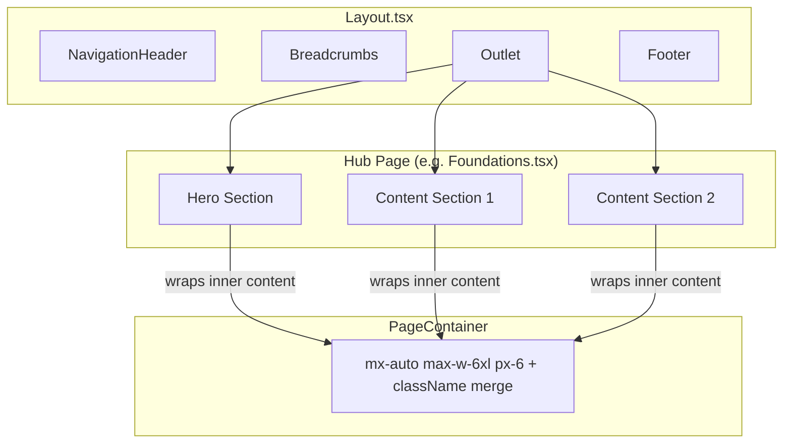

# Design Document: Inner Page Layout Alignment

## Overview

This feature standardises the 8 inner hub pages (Foundations, Components, Patterns, Archetypes, Systems, Services, Resources, Governance) to match the landing page's (`UnifiedHome.tsx`) visual rhythm. The landing page uses `mx-auto max-w-6xl px-6` (1152px max-width, 24px horizontal padding) as its container pattern, while inner pages diverge with `max-w-[1440px]`, `max-w-7xl`, or `max-w-[1400px]` and inconsistent responsive padding, hero spacing, grid ratios, and CTA button styles.

The solution introduces a shared `PageContainer` React component that enforces the reference container pattern, then migrates each hub page phase-by-phase to use it — aligning hero sections, content sections, grid ratios, and CTA buttons to the landing page's visual baseline.

### Current State Audit

| Page | Container | Hero Padding | Grid Ratio | CTA Radius |
|------|-----------|-------------|------------|------------|
| **Landing (reference)** | `max-w-6xl px-6` | `py-16 sm:py-20 lg:py-24` | `1.02fr/0.98fr` | `rounded-full` on hero, `rounded-xl` on inner |
| Foundations | `max-w-[1440px] px-4 sm:px-6 lg:px-8` | `py-10 sm:py-12 lg:py-14` | `1.08fr/0.92fr` | `rounded-xl` ✓ |
| Components | `max-w-7xl px-4 sm:px-6 lg:px-8` | `py-8 lg:py-10` | `1.2fr/0.8fr` | `rounded-full` |
| Patterns | `max-w-[1440px] px-4 sm:px-6 lg:px-8` | `py-10 sm:py-12 lg:py-14` | `1.14fr/0.86fr` | `rounded-xl` ✓ |
| Archetypes | `max-w-[1440px] px-6 sm:px-8 lg:px-12` | `py-10 sm:py-12 lg:py-14` | `1.2fr/0.8fr` | `rounded-full` |
| Systems | `max-w-[1440px] px-4 sm:px-6 lg:px-8` | `py-10 sm:py-12 lg:py-14` | `1.2fr/0.8fr` | `rounded-xl` ✓ |
| Services | `max-w-[1440px] px-6 sm:px-8 lg:px-12` | `py-10 sm:py-12 lg:py-14` | `1.15fr/0.85fr` | `rounded-full` |
| Resources | `max-w-[1440px] px-6 sm:px-8 lg:px-12` | `py-8 sm:py-10 lg:py-12` | `1.15fr/0.85fr` | `rounded-full` |
| Governance | `max-w-[1440px] px-6 sm:px-8 lg:px-12` | `py-10 sm:py-12 lg:py-14` | `1.15fr/0.85fr` | `rounded-full` |

### Design Decisions

1. **PageContainer as a component, not a utility class**: A React component provides type safety, enforces the `as` prop for semantic HTML, and makes future container changes a single-file edit.
2. **Landing page hero CTAs use `rounded-full`; inner pages will use `rounded-xl`**: The requirements specify `rounded-xl` for inner hub pages to match the Foundations/Patterns style. The landing page hero CTAs are out of scope.
3. **Grid ratio range `1.02fr–1.08fr`**: The landing page uses `1.02fr/0.98fr`. Inner pages will standardise to `1.05fr/0.95fr` as a balanced midpoint within the allowed range.
4. **Layout.tsx remains unchanged**: The `Layout.tsx` wrapper provides the shell (header, footer, breadcrumbs) but does not enforce a container. Each page continues to own its container via `PageContainer`.

## Architecture



The `PageContainer` component sits inside each page's sections, replacing the per-page `mx-auto max-w-[1440px] px-6 sm:px-8 lg:px-12` divs. The outer `<section>` elements (which carry background gradients and border styles) remain full-width; only the inner content wrapper uses `PageContainer`.

## Components and Interfaces

### PageContainer Component

**File**: `src/app/components/PageContainer.tsx`

```typescript
import type { ElementType, ComponentPropsWithoutRef, ReactNode } from "react";
import { cn } from "@/app/react-core-package/src/utils/cn";

type PageContainerProps<T extends ElementType = "div"> = {
  /** HTML element to render (default: "div") */
  as?: T;
  /** Additional classes merged with the base container classes */
  className?: string;
  /** Child content */
  children: ReactNode;
} & Omit<ComponentPropsWithoutRef<T>, "as" | "className" | "children">;

const BASE_CLASSES = "mx-auto max-w-6xl px-6";

export default function PageContainer<T extends ElementType = "div">({
  as,
  className,
  children,
  ...rest
}: PageContainerProps<T>) {
  const Component = as || "div";
  return (
    <Component className={cn(BASE_CLASSES, className)} {...rest}>
      {children}
    </Component>
  );
}

PageContainer.displayName = "PageContainer";
```

**Key design choices:**
- Uses the existing `cn()` utility (from `clsx` + `tailwind-merge`) for class merging, which is already the project convention.
- Generic `as` prop allows rendering as `div`, `section`, `header`, `nav`, etc. for semantic HTML.
- `BASE_CLASSES` is a constant so it can be tested and referenced.
- The component is intentionally minimal — no context, no state, no side effects.

### Standardised Class Tokens

These are the reference class sets that each hub page section must adopt:

| Section | Classes |
|---------|---------|
| **Container** | `mx-auto max-w-6xl px-6` (via `PageContainer`) |
| **Hero vertical padding** | `py-16 sm:py-20 lg:py-24` |
| **Hero grid** | `grid gap-12 lg:grid-cols-[1.05fr_0.95fr] lg:items-start` (or `lg:items-center` where appropriate) |
| **H1 heading** | `text-4xl sm:text-5xl lg:text-6xl font-bold tracking-tight` |
| **Description paragraph** | `text-lg sm:text-xl leading-relaxed` |
| **Eyebrow badge** | `text-xs font-semibold uppercase tracking-[0.22em]` |
| **Primary CTA** | `rounded-xl bg-primary px-5 py-3 text-sm font-semibold text-primary-foreground` |
| **Secondary CTA** | `rounded-xl border-2 border-border bg-card px-5 py-3 text-sm font-semibold text-foreground` |
| **Content section padding** | `py-16 sm:py-20` (consistent vertical rhythm) |

### Integration with Layout.tsx

`Layout.tsx` is **not modified**. It continues to render `<Outlet />` inside `<main>`. Each hub page wraps its own content in `PageContainer` instances. This preserves the existing architecture where:
- Full-width backgrounds (gradients, borders) live on the outer `<section>` or `<header>` elements.
- Content width constraint lives inside via `PageContainer`.

### Migration Pattern Per Page

Each hub page follows this transformation pattern:

**Before (example from Governance.tsx):**
```tsx
<header className="border-b border-border bg-[...]">
  <div className="mx-auto grid max-w-[1440px] gap-8 px-6 py-10 sm:px-8 sm:py-12 lg:px-12 lg:py-14 xl:grid-cols-[1.15fr_0.85fr]">
    ...
  </div>
</header>
```

**After:**
```tsx
<header className="border-b border-border bg-[...]">
  <PageContainer className="grid gap-12 py-16 sm:py-20 lg:grid-cols-[1.05fr_0.95fr] lg:items-start lg:py-24">
    ...
  </PageContainer>
</header>
```

For content sections:

**Before:**
```tsx
<div className="mx-auto max-w-[1440px] space-y-20 px-6 py-12 sm:px-8 lg:px-12">
```

**After:**
```tsx
<PageContainer className="space-y-20 py-16 sm:py-20">
```

## Data Models

No new data models are introduced. This feature modifies only presentation-layer components (CSS classes and a shared wrapper component). All existing data structures, i18n copy objects, route definitions, and content arrays remain unchanged.

## Correctness Properties

*A property is a characteristic or behavior that should hold true across all valid executions of a system — essentially, a formal statement about what the system should do. Properties serve as the bridge between human-readable specifications and machine-verifiable correctness guarantees.*

### Property 1: PageContainer base class invariant

*For any* className prop value (including `undefined`, empty string, or any arbitrary Tailwind class string), the rendered `PageContainer` element SHALL always contain the base classes `mx-auto`, `max-w-6xl`, and `px-6` in its className attribute.

**Validates: Requirements 1.1, 1.2**

## Error Handling

This feature introduces no new error states or failure modes. The `PageContainer` component is a pure presentational wrapper with no async operations, API calls, or state management.

**Potential issues and mitigations:**
- **Class conflict via `className` prop**: The `cn()` utility (powered by `tailwind-merge`) resolves Tailwind class conflicts by keeping the last-specified class. If a consumer passes `max-w-7xl` via `className`, `tailwind-merge` will resolve the conflict. This is acceptable — the property test validates that the base classes are present when no conflicting classes are passed. Documentation should note that passing conflicting width/padding classes is unsupported.
- **Invalid `as` prop**: TypeScript generics constrain the `as` prop to valid `ElementType` values at compile time. No runtime validation is needed.

## Testing Strategy

### Unit Tests (Vitest + Testing Library)

Unit tests verify specific examples and edge cases for the `PageContainer` component and the per-page migration:

1. **PageContainer renders base classes** — render with no extra props, verify `mx-auto max-w-6xl px-6` on the wrapper.
2. **PageContainer merges additional classes** — render with `className="py-16 bg-red-500"`, verify both base and extra classes present.
3. **PageContainer `as` prop** — render as `section`, verify the DOM element is `<section>`.
4. **PageContainer renders children** — pass child elements, verify they appear in the DOM.
5. **PageContainer default element** — render with no `as` prop, verify the DOM element is `<div>`.

Per-page migration tests (one test per hub page, run after each phase):

6. **Hero section uses reference spacing** — for each migrated hub page, render and verify the hero container has `py-16` (or responsive equivalents).
7. **H1 uses reference size classes** — for each migrated hub page, verify the h1 has `text-4xl sm:text-5xl lg:text-6xl font-bold tracking-tight`.
8. **CTA buttons use `rounded-xl`** — for each migrated hub page, verify no CTA buttons use `rounded-full`.
9. **Content sections use `max-w-6xl`** — for each migrated hub page, verify no content sections use `max-w-[1440px]`, `max-w-7xl`, or `max-w-[1400px]`.
10. **Dark mode classes preserved** — for each migrated hub page, verify `dark:` variant classes remain on key elements.
11. **ARIA attributes preserved** — for each migrated hub page, verify existing `role`, `aria-*`, and `tabIndex` attributes are unchanged.

### Property-Based Tests (Vitest + fast-check)

Property-based testing is applicable for the `PageContainer` component's class-merging behavior, where the input space (arbitrary className strings) is large.

- **Library**: `fast-check` (already compatible with Vitest)
- **Minimum iterations**: 100
- **Tag format**: `Feature: inner-page-layout-alignment, Property 1: PageContainer base class invariant`

The property test generates arbitrary strings as `className` prop values and verifies the rendered element always contains the three base classes.

### Visual Regression Tests (Playwright)

After each phase, Playwright visual regression tests at three viewports:
- **Desktop**: 1440px width
- **Tablet**: 768px width
- **Mobile**: 375px width

These verify container width, gutter alignment, hero spacing, and grid collapse behavior match the landing page's visual rhythm.

### Smoke Tests

- **Routes unchanged**: Verify `routes.tsx` has no modifications after all phases.
- **i18n keys unchanged**: Verify no translation keys are added, removed, or renamed in hub page files.
