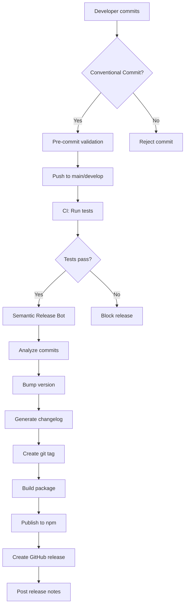

# Automated Releases - Review

**Date:** April 12, 2026  
**Status:** ❌ **COMPLETELY MISSING**

---

## Executive Summary

**There is NO automated release system in place.** The project has zero release automation infrastructure, no versioning strategy, no changelog generation, and no CI/CD pipeline for publishing releases.

**Severity:** Critical (No release process exists)  
**Impact:** Manual releases only, high risk of errors, no version transparency

---

## Current State: What Exists

### ✅ Minimal Infrastructure

1. **GitHub Workflows** (`.github/workflows/`)
   - ✅ `storybook-tests.yml` - Only tests Storybook, no release automation
   - ❌ No release workflow
   - ❌ No publish workflow
   - ❌ No version bump workflow
   - ❌ No changelog generation workflow

2. **Package Versions**
   - Main package: `@figma/my-make-file` v0.0.1 (private)
   - React Core: `@ux4g/react-core` v1.0.0
   - No version bump scripts
   - No semantic versioning automation

3. **Package.json Scripts**
   
   **Main package.json:**
   ```json
   {
     "scripts": {
       "build": "vite build"
     }
   }
   ```
   
   **React Core package.json:**
   ```json
   {
     "scripts": {
       "build": "tsup src/index.ts --format cjs,esm --dts --clean",
       "test": "jest",
       "storybook": "storybook dev -p 6006"
     }
   }
   ```
   
   **Missing Scripts:**
   - ❌ No `version` script
   - ❌ No `release` script
   - ❌ No `publish` script
   - ❌ No `changelog` script
   - ❌ No `prerelease` hooks
   - ❌ No `postrelease` hooks

4. **Git Tags**
   - ❌ No git tags exist
   - ❌ No version tags
   - ❌ No release tags

### ❌ What's Completely Missing

1. **Release Automation Tools** - None installed
   - ❌ No semantic-release
   - ❌ No standard-version
   - ❌ No release-it
   - ❌ No auto-changelog
   - ❌ No conventional-changelog
   - ❌ No changesets

2. **Changelog Files**
   - ❌ No CHANGELOG.md
   - ❌ No RELEASES.md
   - ❌ No VERSION file
   - ❌ No release notes

3. **CI/CD Workflows**
   - ❌ No automated version bumping
   - ❌ No automated changelog generation
   - ❌ No automated GitHub releases
   - ❌ No automated npm publishing
   - ❌ No automated git tagging

4. **Commit Conventions**
   - ❌ No conventional commits enforcement
   - ❌ No commitlint
   - ❌ No husky pre-commit hooks for commits
   - ❌ No commit message validation

5. **Release Documentation**
   - ❌ No release process documentation
   - ❌ No versioning strategy documented
   - ❌ No contributing guidelines for releases
   - ❌ No README mention of releases

---

## Critical Issues

### Issue 1: No Release Process (Severity: Critical)

**Problem:** There is no defined process for creating releases

**Impact:**
- Impossible to track version history
- No way to communicate changes to users
- No rollback strategy
- Manual version management is error-prone
- Cannot publish to npm registry reliably

**Evidence:**
- Zero git tags
- No release workflows
- No version bump scripts
- Package versions are static (v0.0.1, v1.0.0)

---

### Issue 2: No Changelog Automation (Severity: Critical)

**Problem:** No automated changelog generation from commits

**Impact:**
- Users cannot see what changed between versions
- Developers must manually write release notes
- Breaking changes not documented
- Migration guides missing
- Poor transparency

**Evidence:**
- No CHANGELOG.md file
- No changelog generation tools
- Documentation.tsx has hardcoded version data
- Only 3 versions referenced (all hardcoded)

---

### Issue 3: No Semantic Versioning (Severity: High)

**Problem:** No enforcement or automation of semantic versioning

**Impact:**
- Breaking changes not communicated via version
- Patch/minor/major updates unclear
- Dependency management difficult
- Consumers cannot rely on version numbers

**Evidence:**
- No semantic-release tooling
- No conventional commits
- No version bump automation
- Manual version updates in package.json

---

### Issue 4: No CI/CD for Publishing (Severity: High)

**Problem:** No automated publishing to npm or GitHub releases

**Impact:**
- Manual publish process is error-prone
- No consistency in releases
- Risk of publishing wrong version
- No automated testing before release
- Cannot unpublish easily

**Evidence:**
- No GitHub Actions workflow for publishing
- No npm publish scripts
- No release-please or similar tools
- Repository URL exists but no releases

---

### Issue 5: No Git Tags (Severity: Medium)

**Problem:** No version tags in git history

**Impact:**
- Cannot checkout specific versions
- No git-based version tracking
- Hard to trace code to releases
- No version anchors in history

**Evidence:**
```bash
git tag -l
# Returns nothing
```

---

## Recommended Architecture

### Complete Automated Release System



---

## Implementation Plan

### Phase 1: Foundation (Week 1)

**1.1 Install Release Tools**
```bash
pnpm add -D semantic-release \
  @semantic-release/changelog \
  @semantic-release/git \
  @semantic-release/github \
  @semantic-release/npm \
  conventional-changelog-cli \
  commitlint \
  @commitlint/config-conventional \
  husky
```

**1.2 Configure Conventional Commits**

Create `.commitlintrc.json`:
```json
{
  "extends": ["@commitlint/config-conventional"],
  "rules": {
    "type-enum": [2, "always", [
      "feat", "fix", "docs", "style", "refactor",
      "perf", "test", "build", "ci", "chore"
    ]]
  }
}
```

Create `.husky/commit-msg`:
```bash
#!/bin/sh
npx --no -- commitlint --edit $1
```

**1.3 Add Release Scripts**

Update `package.json`:
```json
{
  "scripts": {
    "release": "semantic-release",
    "release:dry": "semantic-release --dry-run",
    "version:patch": "npm version patch",
    "version:minor": "npm version minor",
    "version:major": "npm version major",
    "changelog": "conventional-changelog -p angular -i CHANGELOG.md -s"
  }
}
```

---

### Phase 2: Automation (Week 2)

**2.1 Create Release Workflow**

Create `.github/workflows/release.yml`:
```yaml
name: Release

on:
  push:
    branches: [main]

permissions:
  contents: write
  issues: write
  pull-requests: write
  packages: write

jobs:
  release:
    runs-on: ubuntu-latest
    steps:
      - name: Checkout
        uses: actions/checkout@v4
        with:
          fetch-depth: 0
          persist-credentials: false

      - name: Setup Node.js
        uses: actions/setup-node@v4
        with:
          node-version: '18'
          cache: 'pnpm'

      - name: Install pnpm
        uses: pnpm/action-setup@v2
        with:
          version: 8

      - name: Install dependencies
        run: pnpm install --frozen-lockfile

      - name: Build
        run: pnpm build

      - name: Run tests
        run: pnpm test

      - name: Semantic Release
        env:
          GITHUB_TOKEN: ${{ secrets.GITHUB_TOKEN }}
          NPM_TOKEN: ${{ secrets.NPM_TOKEN }}
        run: npx semantic-release
```

**2.2 Configure Semantic Release**

Create `.releaserc.json`:
```json
{
  "branches": ["main"],
  "plugins": [
    "@semantic-release/commit-analyzer",
    "@semantic-release/release-notes-generator",
    [
      "@semantic-release/changelog",
      {
        "changelogFile": "CHANGELOG.md"
      }
    ],
    [
      "@semantic-release/npm",
      {
        "npmPublish": true
      }
    ],
    [
      "@semantic-release/git",
      {
        "assets": ["CHANGELOG.md", "package.json"],
        "message": "chore(release): ${nextRelease.version} [skip ci]\n\n${nextRelease.notes}"
      }
    ],
    [
      "@semantic-release/github",
      {
        "assets": [
          {
            "path": "dist/**"
          }
        ]
      }
    ]
  ]
}
```

---

### Phase 3: Documentation (Week 3)

**3.1 Create CHANGELOG.md**

Initialize with current version:
```markdown
# Changelog

All notable changes to this project will be documented in this file.

The format is based on [Keep a Changelog](https://keepachangelog.com/en/1.0.0/),
and this project adheres to [Semantic Versioning](https://semver.org/spec/v2.0.0.html).

## [1.0.0] - 2026-04-12

### Added
- Initial release of UX4G Design System Platform
- React component library with 73 components
- Complete design token system
- Accessibility features (WCAG 2.1 AA)
- Multi-framework support (React, Angular, Web Components)

[1.0.0]: https://github.com/ux4g/react-core/releases/tag/v1.0.0
```

**3.2 Add CONTRIBUTING.md Section**

```markdown
## Commit Message Format

This project follows [Conventional Commits](https://www.conventionalcommits.org/).

### Format
```
<type>(<scope>): <subject>

<body>

<footer>
```

### Types
- **feat**: New feature
- **fix**: Bug fix
- **docs**: Documentation only
- **style**: Code style changes (formatting, etc)
- **refactor**: Code change that neither fixes a bug nor adds a feature
- **perf**: Performance improvement
- **test**: Adding or updating tests
- **build**: Build system or dependency changes
- **ci**: CI configuration changes
- **chore**: Other changes that don't modify src or test files

### Examples
```bash
feat(button): add loading state prop
fix(input): resolve focus trap on mobile
docs(readme): update installation instructions
```
```

**3.3 Update README.md**

Add versioning section:
```markdown
## Versioning

This project uses [Semantic Versioning](https://semver.org/):
- **Major** (1.x.x): Breaking changes
- **Minor** (x.1.x): New features, backwards compatible
- **Patch** (x.x.1): Bug fixes, backwards compatible

See [CHANGELOG.md](./CHANGELOG.md) for release history.
```

---

### Phase 4: Integration (Week 4)

**4.1 Create Release Checklist**

Create `.github/PULL_REQUEST_TEMPLATE.md`:
```markdown
## Description
<!-- Describe your changes -->

## Type of Change
- [ ] 🐛 Bug fix (non-breaking change which fixes an issue)
- [ ] ✨ New feature (non-breaking change which adds functionality)
- [ ] 💥 Breaking change (fix or feature that would cause existing functionality to not work as expected)
- [ ] 📝 Documentation update

## Checklist
- [ ] My code follows the conventional commits format
- [ ] I have added tests that prove my fix is effective or that my feature works
- [ ] New and existing unit tests pass locally with my changes
- [ ] I have updated the documentation accordingly
- [ ] My changes generate no new warnings

## Breaking Changes
<!-- If this introduces breaking changes, describe the migration path -->
```

**4.2 Add Pre-release Workflow**

Create `.github/workflows/pre-release.yml`:
```yaml
name: Pre-Release Checks

on:
  pull_request:
    branches: [main]

jobs:
  validate:
    runs-on: ubuntu-latest
    steps:
      - uses: actions/checkout@v4
        with:
          fetch-depth: 0

      - name: Validate commit messages
        uses: wagoid/commitlint-github-action@v5

      - name: Check if version will bump
        run: npx semantic-release --dry-run
```

---

## Required Tooling Comparison

| Tool | Purpose | Recommendation |
|------|---------|----------------|
| **semantic-release** | Automated releases | ✅ **Recommended** - Industry standard |
| standard-version | Manual releases with automation | ⚠️ Alternative if manual control needed |
| release-please | Google's release tool | ⚠️ Good for monorepos |
| changesets | Monorepo versioning | ⚠️ If you have multiple packages |
| conventional-changelog | Changelog generation only | ✅ Use with semantic-release |
| commitlint | Enforce commit format | ✅ **Required** |
| husky | Git hooks | ✅ **Required** |

---

## Success Metrics

| Metric | Current | Target | Priority |
|--------|---------|--------|----------|
| Automated releases | 0% | 100% | Critical |
| Release workflows | 0 | 1+ | Critical |
| Git tags | 0 | 10+ | High |
| Changelog entries | 0 | All releases | High |
| Commit conventions | ❌ | ✅ Enforced | Medium |
| NPM publishes | Manual | Automated | High |
| Release time | Unknown | < 5 min | Medium |
| Release errors | Unknown | < 1% | High |

---

## Risk Assessment

### Risks of NOT Implementing

1. **Version Chaos** 🔴 High Risk
   - No version tracking = cannot rollback
   - Breaking changes not communicated
   - Dependency hell for consumers

2. **Manual Errors** 🔴 High Risk
   - Wrong version published
   - Changelog out of sync
   - Missing git tags
   - Incomplete releases

3. **Poor Communication** 🟡 Medium Risk
   - Users don't know what changed
   - Migration guides missing
   - Breaking changes undocumented

4. **Developer Frustration** 🟡 Medium Risk
   - Time-consuming manual process
   - Inconsistent release quality
   - Difficult to contribute

### Risks of Implementing

1. **Learning Curve** 🟢 Low Risk
   - Team needs to learn conventional commits
   - **Mitigation:** Training session + documentation

2. **Initial Setup Time** 🟢 Low Risk
   - 1-2 weeks to implement
   - **Mitigation:** Follow phased approach

3. **CI/CD Costs** 🟢 Low Risk
   - GitHub Actions minutes
   - **Mitigation:** Free for public repos

---

## Estimated Effort

| Phase | Tasks | Time | Priority |
|-------|-------|------|----------|
| Phase 1 | Install tools, configure commits | 8 hours | Critical |
| Phase 2 | Create workflows, automate release | 16 hours | Critical |
| Phase 3 | Documentation, guidelines | 8 hours | High |
| Phase 4 | Integration, testing | 8 hours | Medium |
| **Total** | **Complete automation** | **40 hours** | **5 weeks** |

---

## Quick Wins (Immediate Actions)

### 1. Create CHANGELOG.md (30 min)
```bash
touch CHANGELOG.md
# Add initial entry for v1.0.0
```

### 2. Add Version Bump Scripts (15 min)
```json
{
  "scripts": {
    "version:patch": "npm version patch",
    "version:minor": "npm version minor",
    "version:major": "npm version major"
  }
}
```

### 3. Create First Git Tag (5 min)
```bash
git tag -a v1.0.0 -m "Initial release"
git push origin v1.0.0
```

### 4. Document Current Version (15 min)
Update README.md with current version and link to releases

---

## Conclusion

**The project has ZERO automated release infrastructure.** This is a critical gap that should be addressed immediately to:

1. ✅ Enable version tracking and rollbacks
2. ✅ Communicate changes to users transparently
3. ✅ Reduce manual errors in release process
4. ✅ Standardize release workflow
5. ✅ Improve developer experience

**Recommended Next Step:** Implement Phase 1 (Foundation) immediately - install semantic-release and configure conventional commits. This provides immediate value with minimal disruption.

**Priority:** 🔴 **Critical** - Should be top priority after fixing broken changelog links.
